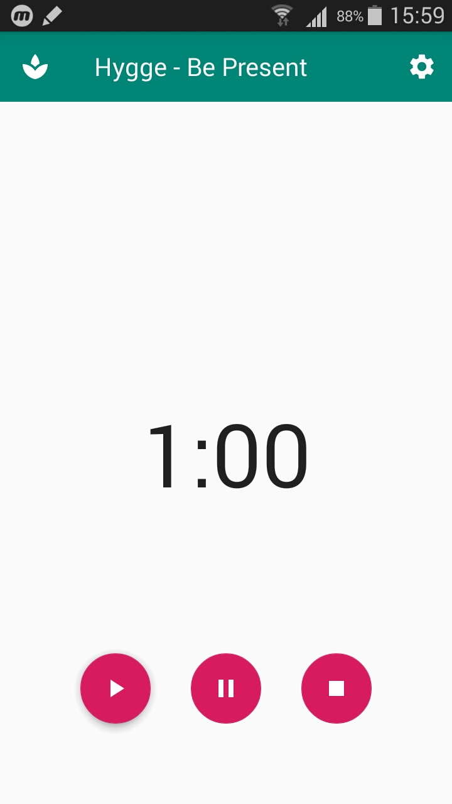
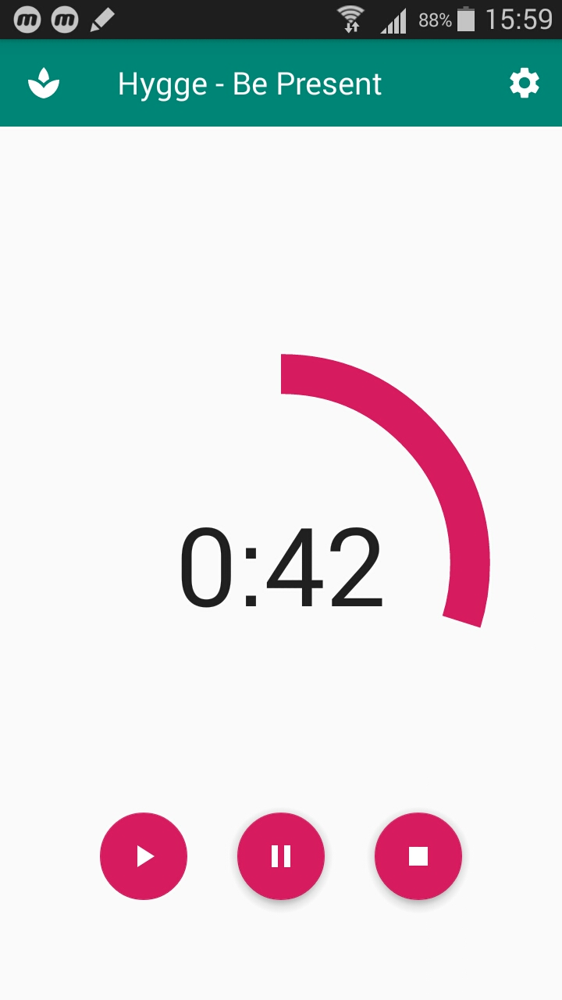
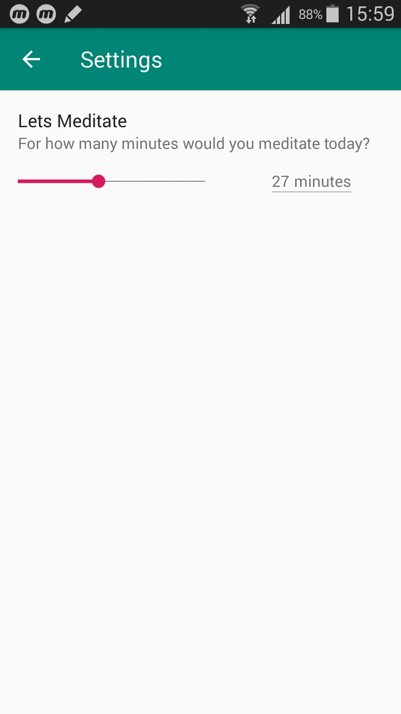

# Hygge - Be Present
#### Give your mind some rest, it will gift you with answers you are searching for. 

### Description
In this time, where there no definite boundaries between working hours and resting hours. It is crucial to take some time out for mindfulness. Presenting Hygge, it goes by its name of providing a warm, pleasent and comfortable atmosphere, void of annoyance and distraction, where you can be at total ease. It is described as something we ‘want all the time- but seldom have’. 

### Application features:

- Set the time you want to meditate through settings, you can choose the perfect length to fit with your schedule (10 minutes     recommended)
- Hit the Start or Play button and Relax and meditate and be at the moment, the application provides you with an ambient environment, 
  playing soothing music in the background while you meditate. (wear headphones for best experience)
- Disturbed? no worries hit the pause button, to pause or the stop button to start again altogether.
- If distracted and moved to another application, the timer would be paused and would resume when returned.
- ##### Play to give wings to your worries and watch them fly...
____________________________

## Screenshots

### main_activity

### main_activity (Running)

### setting_activity 

## Watch [Demo_video](demo_video.mp4)
#### Note:(IMPORTANT) video works best with GOM Player. 

### Credits
This application uses Open Source components. You can find the source code of their open source projects below. I am grateful to these developers for their contributions to open source.
- Material ProgressBar Library: https://github.com/zhanghai/MaterialProgressBar
- Material Seekbar Preference Library: https://github.com/MrBIMC/MaterialSeekBarPreference

### So what are you waiting for, Try it now!
